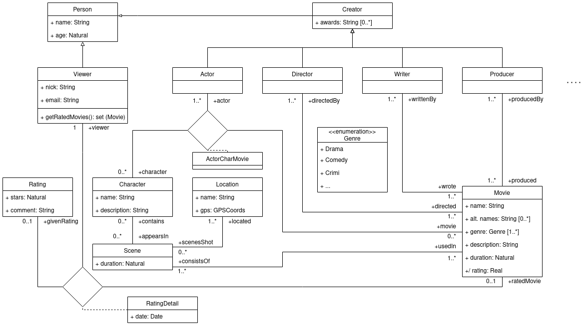

# Movie database

## UML diagram



### Classes and associations

`Person` je třída, od které dědí třídy `Viewer` a `Creator`. Reprezentuje člověka a jeho základní údaje jako jméno a věk.

`Creator` je třída, od které dědí všechny umělecké profese filmové domény jako jsou zobrazené třídy `Actor`, `Director`, `Writer` a `Producer`, ale i další - znázorněno tečkami.

Třídy, které jsou potomky třídy `Creator` mají určitý vztah ke třídě `Movie`. Například `Actor` je svázaný jak s filmem(`Movie`), ve kterém hrál, tak s rolí(`Character`), kterou v daném filmu hrál. Vztah je proto reprezentován jako ternární.

Herec mohl danou roli hrát jak ve filmové sérii, tak roli nemusel hrát vůbec. Herec ve filmu mohl hrát klidně i více rolí, avšak také ve filmu nemusel hrát vůbec. *Pro zjednodušení počítám s tím, že postavu ve filmu hraje aspoň jeden herec. Ikdyž jde o animovanou postavu, někdo jí dal hlas.*

K procházení ternárních asociací existuje třída `ActorCharMovie`. *Podobný vztah jako mají herec, film a postava by byl možný i pro jiné potomky třídy `Creator`. Například grafik by mohl mít vztah (`Movie`, `Graphic Designer`, `Poster/Magazine Cover`).*

Film(`Movie`) je tvořen z aspoň jedné scény(`Scene`), která se natáčela na aspoň jednom místě(`Location`).

`Movie` mohl také být hodnocený a to vždy nějakým divákem(`Viewer`), který filmu dal daný `Rating`. Divák mohl a nemusel (`0..1`) dát dané hodnocení filmu a divák mohl a nemusel daný film hodnotit.

## OCL integrity constraints

* 1 invariant
* 1 pre-condition
* 1 post-condition
* 1 default value
* once select/reject
* once forAll/exists
* once size

### 1 default value

```ocl
-- Creator does not win an award right away.

context: Creator::awards
init: Set {}
```

### 1 pre-condition and post-condition

```ocl
-- Viewer deletes his/her rating R for some movie.

context: Viewer::deleteRating(R:Rating) : void
pre: self.RatingDetail[rating]->includes(R)
post: self.RatingDetail[rating]->excludes(R)
```

### once size

```ocl
-- Derivation of the movies overall rating.

context: Movie::rating : Real
derive: result = self.RatingDetail[rating]->iterate(r:Rating, acc:Int = 0 | acc = acc + r.stars) / self.RatingDetail[movie]->size()
```

### once select/reject

```ocl
-- Get movies with more than s stars in overall rating.

context: RatingDetail::moviesBetterThan(s:Real) : set (Movie)
inv: result = self.ratedMovie->select(m:Movie | m.rating >= s)
```

### once forAll/exists

```ocl
-- Naive interpretation of a genius director. There is not a movie that recieved a zero star rating. At least one of his/her movies should be rated in order to consider him/her.

context: Director::isGenius() : Boolean
pre: self.directed.RatingDetail[rating]->size() > 0
body: self.directed->forAll(m:Movie | not m.RatingDetail[givenRating]->exists(r:Rating | r.stars = 0))
```
